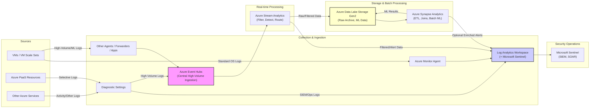

```mermaid
graph LR
    subgraph Sources
        A[VMs / VM Scale Sets]
        B[Azure PaaS Resources]
        C[Other Azure Services]
    end

    subgraph Collection & Ingestion
        AMA[Azure Monitor Agent]
        OTH[Other Agents / Forwarders / Apps]
        DIAG[Diagnostic Settings]
        EH["Azure Event Hubs\n(Central High-Volume Ingestion)"]
        LA["Log Analytics Workspace\n(+ Microsoft Sentinel)"]
    end

    subgraph Real-time Processing
        ASA["Azure Stream Analytics\n(Filter, Detect, Route)"]
    end

    subgraph Storage & Batch Processing
        ADLS["Azure Data Lake Storage Gen2\n(Raw Archive, ML Data)"]
        SYN["Azure Synapse Analytics\n(ETL, Joins, Batch ML)"]
    end

    subgraph Security Operations
        SENTINEL["Microsoft Sentinel\n(SIEM, SOAR)"]
    end

    A -- Standard OS Logs --> AMA
    A -- High-Volume/ML Logs --> OTH
    OTH --> EH

    B -- Selective Logs --> DIAG
    C -- Activity/Other Logs --> DIAG
    DIAG -- SIEM/Ops Logs --> LA
    DIAG -- High-Volume Logs --> EH

    AMA --> LA

    EH --> ASA

    ASA -- Filtered/Alert Data --> LA
    ASA -- Raw/Filtered Data --> ADLS

    LA --> SENTINEL

    ADLS --> SYN
    SYN -- ML Results --> ADLS
    SYN -- Optional Enriched Alerts --> LA

    style EH fill:#f9f,stroke:#333,stroke-width:2px
    style LA fill:#ccf,stroke:#333,stroke-width:2px
    style ADLS fill:#ffc,stroke:#333,stroke-width:2px

``` 